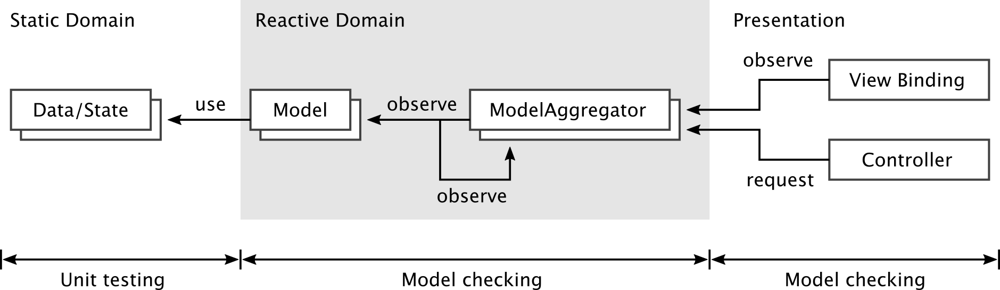
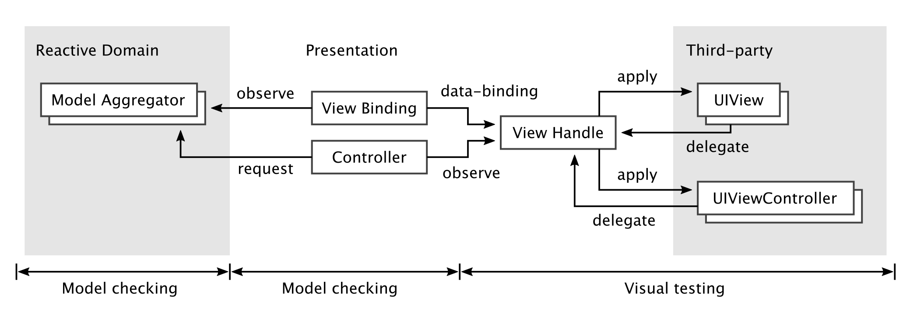
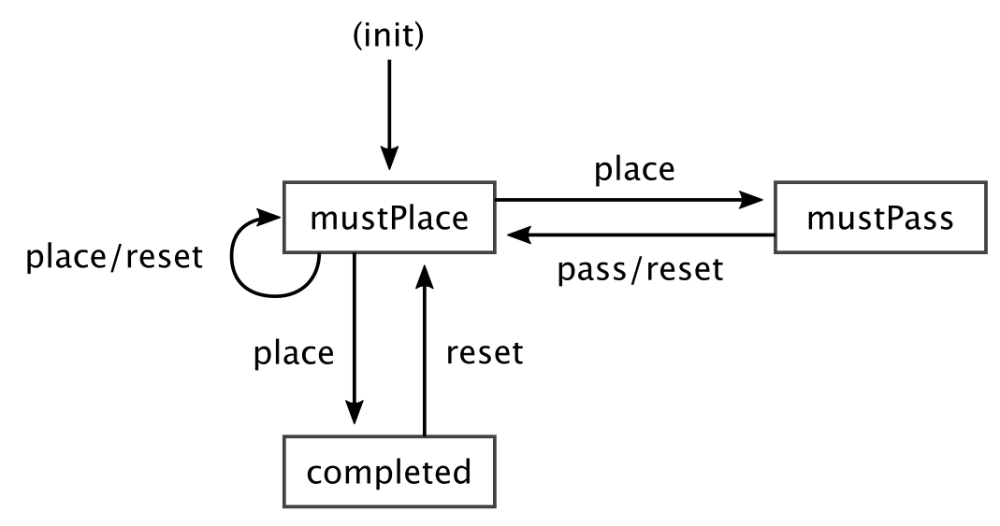
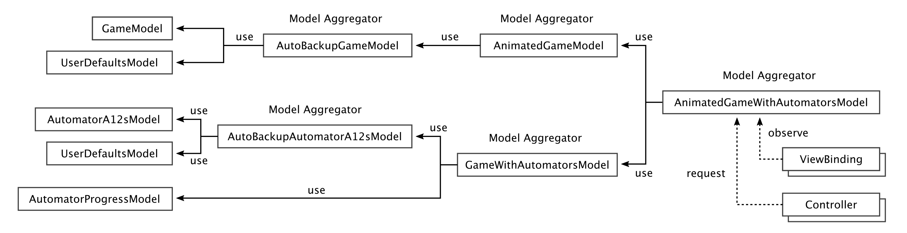

# リファクタリング・チャレンジ （リバーシ編） iOS版
[](https://app.bitrise.io/app/43c2cea1787e1f40)
[](https://circleci.com/gh/Kuniwak/reversi-ios/tree/master)


> 本チャレンジは、 _Fat View Controller_ として実装された[リバーシ](https://en.wikipedia.org/wiki/Reversi)アプリをリファクタリングし、どれだけクリーンな設計とコードを実現できるかというコンペティションです（ジャッジが優劣を判定するわけではなく、設計の技を競い合うのが目的です）。
>
> 
>
> [reversi-ios/README.md](https://github.com/refactoring-challenge/reversi-ios)


# リファクタリングの方針

このリポジトリはフルスクラッチで理想的な設計を目指しました。なお、作業者は以下のシチュエーションを想像しながら進めました（過剰なリファクタリングではありません、いいですね？）：

* このアプリがクラッシュしたら人が死ぬ
* クラッシュじゃないバグでも大変なことになってしまう

一般的には、多少バグがあっても魅力的な機能のリリースを優先することもあります。しかしこのリポジトリでは多少のバグも許されないので、あの手この手でバグを防がねばなりません（ということになっています）。この結果は末尾の「[リファクタリングの結果](#リファクタリングの結果)」に記載してあります。


## 前提

バグを減らすための唯一の方法は **とにかく可能な入力を試す** ことです。可能な入力を試す手段には色々なものがあります：

* 手動ポチポチ
* 従来の自動テスト（XCTest/Quickなど）
* 型以外の静的検査（SwiftLintなど）
* 型検査
* モデル検査（このモデルは MVC/MVVM の Model とは別の意味）や証明

このうち、このリポジトリで採用したのはほぼ型検査と自動テスト（と少しだけ手動ポチポチ）です。中でも特に静的型検査に力を入れました。

これは「とにかく可能な入力を試す」を達成する方法として静的検査が優れているからです。手動ポチポチや自動テストは、どこかにバグ（欠陥）があってもそれを実行できなければ発見できませんが、型検査はどこか1箇所にでも入力される値の想定ミスがあれば実行せずとも発見できます。
このように、静的型検査を含む静的検査には広範な入力を網羅的に検証できるという特徴を備えています。中でも静的型検査は数ある静的検査の中でも軽量で手軽な手段です（モデル検査や正当性証明は手軽ではない）。

そのため、作者は自動テスト書いたら負けぐらいの気持ちで型検査に力を入れました（この状況を正当化しうるのは、主にリファクタリングの方針で説明されたようなミッションクリティカルシステムのような限定的な場合のみです）。そしてあわよくばモデル検査と正当性証明を狙いました。


## 型設計で考えるべきこと

安全性を重視した型設計をする上でもっとも重要な考え方は **とにかく異常な値が許されないようにする** ことです。もしある型が異常な値を許してしまうとプログラマはその型を信用できません。結果として、プログラムのいたるところに値が意図通りか確かめるコードを書くことになるでしょう（あるいは書き忘れてバグになるかもしれません）。さて、このとき意図通りの値ではないことがわかったとして、常に適切なエラー処理ができるでしょうか？おそらくそうできないことも多いでしょう。特に絶対に失敗しないように思える場所でのエラー処理は雑になりがちで、これがバグの温床になることもあります。そのため、安全な型設計では異常な値を主に次の2つの手段で排除します：

1. 値空間を削る
2. 動的検査後にインスタンスが手に入る

1に出てきた値空間とはある型に対してその型に属する値すべての集合です。例えば `Int32` の値空間には32bitで表現できる整数すべてが入っています。そして値空間を削るとは、この値空間を縮めて異常な値が含まないように型を定義し直すことです。例えば `Int32` から負の数を含まないようにしたのが `UInt32` です（厳密には `Int32` で表現できない大きな整数が代わりに値空間に入ってしまいます）。

さて、1の例をリバーシにおける Line で見てみましょう。Line とは盤面上でひっくり返すときの線を表現しています。次の図は盤面の左上端を抜粋したものです。いま黒い石（`x`）を A1（一番左上の座標）に置けるのは、D1に自分と同じ色の石がありここから左方向へ A1 までの間に相手の白い石（`o`）が連続して配置されているからです：

```
   ABCD
  +----
1 |_oox
2 |
  :
```

このとき、このひっくり返せる線である Line を表現する型の定義には選択肢がたくさんあります。例としてもっとも素直な表現である始点と終点のみを記録する `((Int, Int), (Int, Int))` を考えましょう。この型で前図の例の Line 値を表現すると `((0, 0), (3, 0))` になります。

ここで Line の値空間を考えてみると、以下の `exampleN` はすべて Line の値空間に収まります。

```swift
let example1 = ((0, 0), (3, 0))
let example2 = ((0, 0), (10, -1))
let example3 = ((0, 0), (1, 2))
let example4 = ((0, 0), (0, 0))
```

しかし、このうち2-4は異常な値です（2:盤面の範囲外、3:縦横斜めの線上にない、4:長さが0）。つまり、この Line の型では異常な値が数多く含まれてしまいます。

そこで、今回のリファクタリングではこれらの異常な値を許さない極めて厳密な型を用意しました：

```swift
public struct Line {
    public let start: Coordinate
    public let end: Coordinate
    public let directedDistance: DirectedDistance
}


public struct Coordinate {
    public let x: CoordinateX
    public let y: CoordinateY
}


public enum CoordinateX: Int, CaseIterable {
    case a = 1
    case b
    case c
    case d
    case e
    case f
    case g
    case h
}


public enum CoordinateY: Int, CaseIterable {
    case one = 1
    case two
    case three
    case four
    case five
    case six
    case seven
    case eight
}


public struct DirectedDistance {
    public let direction: Direction
    public let distance: Distance
}


public enum Direction: CaseIterable {
    case top
    case topRight
    case right
    case bottomRight
    case bottom
    case bottomLeft
    case left
    case topLeft
}


public enum Distance: Int, CaseIterable {
    case one = 1
    case two
    case three
    case four
    case five
    case six
    case seven
}
```

この型の座標は、整数の組の代わりに `CoordinateX` などの `enum` を用いているため盤面の外の座標の値は存在できません。ただし、これだけだとまだ `start` と `end` と `directedDistance` が不整合を起こす可能性があります。

そこで、2つめの方法である動的検査後にインスタンスを手に入れられるようにしてみましょう。次の `init` は整合性の動的検査に成功した場合のみ値を生成できるようになっています：


```swift
public struct Line {
    public let start: Coordinate
    public let end: Coordinate
    public let directedDistance: DirectedDistance


    public init?(start: Coordinate, directedDistance: DirectedDistance) {
        guard let end = start.moved(to: directedDistance) else {
            return nil
        }
        self.start = start
        self.end = end
        self.directedDistance = directedDistance
    }
}


public struct Coordinate {
    public let x: CoordinateX
    public let y: CoordinateY


    public func moved(to directedDistance: DirectedDistance) -> Coordinate? {
        // NOTE: Be nil if the X is out of boards.
        let unsafeX: CoordinateX?
        switch directedDistance.direction {
        case .top, .bottom:
            unsafeX = self.x
        case .left, .topLeft, .bottomLeft:
            unsafeX = CoordinateX(rawValue: self.x.rawValue - directedDistance.distance.rawValue)
        case .right, .topRight, .bottomRight:
            unsafeX = CoordinateX(rawValue: self.x.rawValue + directedDistance.distance.rawValue)
        }

        // NOTE: Be nil if the Y is out of boards.
        let unsafeY: CoordinateY?
        switch directedDistance.direction {
        case .left, .right:
            unsafeY = self.y
        case .top, .topLeft, .topRight:
            unsafeY = CoordinateY(rawValue: self.y.rawValue - directedDistance.distance.rawValue)
        case .bottom, .bottomLeft, .bottomRight:
            unsafeY = CoordinateY(rawValue: self.y.rawValue + directedDistance.distance.rawValue)
        }

        switch (unsafeX, unsafeY) {
        case (.none, _), (_, .none):
            return nil
        case (.some(let x), .some(let y)):
            return Coordinate(x: x, y: y)
        }
    }
}
```

2つめの方法は実際のiOSアプリでもバリデーションまわりに応用できます。次のコードは3文字以上のユーザー名のみを許す UserName 型を定義しています。こうすると、UserName を受け取る関数はこの値が異常ではないと信用できるようになります：

```swift
// NOTE: 実際の iOS アプリのバリデーションなどでよく使われる。
public struct UserName {
    public init?(rawValue: String) {
        guard rawValue.count >= 3 else { return nil }
        // ...
        self.rawValue = rawValue
    }
}
```

なお、1はより安全ですが自由度が低く、2は自由度が高いですが安全性の担保には動的テストを必要とするでしょう。

今回のリファクタリングでは以下がそれぞれの実例になっています：

1. 値空間を削る
    * [`Coordinate`](https://github.com/Kuniwak/reversi-ios/blob/35c67ddd69e1708d2a5d8f4c5430ddd9c0150f9b/ReversiCore/ReversiCore/MVCArchitecture/DataTypes/Coordinate.swift)
    * [`NonEmptyArray`](https://github.com/Kuniwak/reversi-ios/blob/35c67ddd69e1708d2a5d8f4c5430ddd9c0150f9b/ReversiCore/ReversiCore/MVCArchitecture/DataTypes/NonEmptyArray.swift)
    * [`Board`](https://github.com/Kuniwak/reversi-ios/blob/35c67ddd69e1708d2a5d8f4c5430ddd9c0150f9b/ReversiCore/ReversiCore/MVCArchitecture/DataTypes/Board.swift)
    * [`GameResult`](https://github.com/Kuniwak/reversi-ios/blob/35c67ddd69e1708d2a5d8f4c5430ddd9c0150f9b/ReversiCore/ReversiCore/MVCArchitecture/DataTypes/GameResult.swift)
2. 動的検査後にインスタンスが手に入る
    * [`Line`](https://github.com/Kuniwak/reversi-ios/blob/35c67ddd69e1708d2a5d8f4c5430ddd9c0150f9b/ReversiCore/ReversiCore/MVCArchitecture/DataTypes/Line.swift)
    * [`FlippableLine`](https://github.com/Kuniwak/reversi-ios/blob/35c67ddd69e1708d2a5d8f4c5430ddd9c0150f9b/ReversiCore/ReversiCore/MVCArchitecture/DataTypes/FlippableLine.swift)


## アーキテクチャについて

<details>
<summary>本質ではないので割愛（見たい方はどうぞ）</summary>

### ドメイン周辺の関連図




### プレゼンテーション周辺の関連図




### 概要

このリポジトリは古典的な MVC（not Cocoa MVC）を iOS に書きやすく適応した亜種を採用しています。

まずは ViewController をご覧ください：

```swift
public class ViewController: UIViewController {
    @IBOutlet private var boardView: BoardView!
    @IBOutlet private var messageDiskView: DiskView!
    @IBOutlet private var messageDiskSizeConstraint: NSLayoutConstraint!
    @IBOutlet private var messageLabel: UILabel!
    @IBOutlet private var countLabels: [UILabel]!
    @IBOutlet private var playerActivityIndicators: [UIActivityIndicatorView]!
    @IBOutlet private var playerControls: [UISegmentedControl]!
    @IBOutlet private var resetButton: UIButton!

    public private(set) var composer: BoardMVCComposer?
    private var modalPresenterQueue: ModalPresenterQueueProtocol?


    public override func viewDidLoad() {
        super.viewDidLoad()

        let modalPresenter = UIKitTestable.ModalPresenter(wherePresentOn: .weak(self))
        let modalPresenterQueue = ModalPresenterQueue()
        self.modalPresenterQueue = modalPresenterQueue

        let boardViewHandle = BoardViewHandle(boardView: self.boardView)

        self.composer = BoardMVCComposer(
            userDefaults: UserDefaults.standard,
            boardViewHandle: boardViewHandle,
            boardAnimationHandle: boardViewHandle,
            gameAutomatorProgressViewHandle: GameAutomatorProgressViewHandle(
                firstActivityIndicator: self.playerActivityIndicators[0],
                secondActivityIndicator: self.playerActivityIndicators[1]
            ),
            gameAutomatorControlHandle: GameAutomatorControlHandle(
                firstSegmentedControl: self.playerControls[0],
                secondSegmentedControl: self.playerControls[1]
            ),
            passConfirmationViewHandle: PassConfirmationHandle(
                willModalsPresentOn: modalPresenter,
                orEnqueueIfViewNotAppeared: modalPresenterQueue
            ),
            resetConfirmationViewHandle: ResetConfirmationHandle(
                button: self.resetButton,
                willModalsPresentOn: modalPresenter,
                orEnqueueIfViewNotAppeared: modalPresenterQueue
            ),
            diskCountViewHandle: DiskCountViewHandle(
                firstPlayerCountLabel: self.countLabels[0],
                secondPlayerCountLabel: self.countLabels[1]
            ),
            turnMessageViewHandle: TurnMessageViewHandle(
                messageLabel: self.messageLabel,
                messageDiskView: self.messageDiskView,
                messageDiskViewConstraint: self.messageDiskSizeConstraint
            )
        )
    }


    public override func viewDidAppear(_ animated: Bool) {
        self.modalPresenterQueue?.viewDidAppear()
    }


    public override func viewWillDisappear(_ animated: Bool) {
        self.modalPresenterQueue?.viewWillDisappear()
    }
}
```

やっていることは、`viewDidLoad` の後でしか手に入らない UIView を View Handle というもの（後述）に包んで `BoardMVCComposer` に渡しているだけです。あとはライフサイクルを必要なコンポーネントへ通知しているだけです。これによって、`UIViewController` は本来の責務であったライフサイクルイベントの管理だけに集中できるようになりました。

さて、中身の `BoardMVCComposer` は古典的な MVC パターンの Model と View（コード上の名前は View Binding） と Controller を接続する責務があります：

```swift
public class BoardMVCComposer {
    public let animatedGameWithAutomatorsModel: AnimatedGameWithAutomatorsModelProtocol

    // ...

    private let boardViewBinding: BoardViewBinding

    // ...

    private let boardController: BoardController

    // ...


    public init(
        userDefaults: UserDefaults,
        // ...
        isEventTracesEnabled: Bool = isDebug
    ) {
        // STEP-1: Constructing Models and Model Aggregates that are needed by the screen.
        //         And models should be shared across multiple screens will arrive as parameters.

        let animatedGameWithAutomatorsModel = AnimatedGameWithAutomatorsModel(/* ... */)
        self.animatedGameWithAutomatorsModel = animatedGameWithAutomatorsModel

        // ...


        // STEP-2: Constructing ViewBindings.
        self.boardViewBinding = BoardViewBinding(
            observing: animatedGameWithAutomatorsModel,
            updating: boardViewHandle
        )

        // ...


        // STEP-3: Constructing Controllers.
        self.boardController = BoardController(
            observing: boardViewHandle,
            requestingTo: animatedGameWithAutomatorsModel
        )

        // ...
    }
```

この中では次の6種類のコンポーネントが登場します：

* MVC Model に相当するもの
    * Model: 変更を外へ通知する状態機械
        * [`GameModel`](https://github.com/Kuniwak/reversi-ios/blob/35c67ddd69e1708d2a5d8f4c5430ddd9c0150f9b/ReversiCore/ReversiCore/MVCArchitecture/Models/GameModel.swift)
        * [`UserDefaultsModel`](https://github.com/Kuniwak/reversi-ios/blob/35c67ddd69e1708d2a5d8f4c5430ddd9c0150f9b/ReversiCore/ReversiCore/MVCArchitecture/Models/UserDefaultsModel.swift)
        * [...](https://github.com/Kuniwak/reversi-ios/tree/35c67ddd69e1708d2a5d8f4c5430ddd9c0150f9b/ReversiCore/ReversiCore/MVCArchitecture/Models)
    * Model Aggregates: Model を複数集めて Model 同士を接続したもの
        * [`AutoBackupGameModel`](https://github.com/Kuniwak/reversi-ios/blob/35c67ddd69e1708d2a5d8f4c5430ddd9c0150f9b/ReversiCore/ReversiCore/MVCArchitecture/Models/ModelAggregates/AutoBackupGameModel.swift) = `GameModel` + `UserDefaultsModel`
        * [...](https://github.com/Kuniwak/reversi-ios/tree/35c67ddd69e1708d2a5d8f4c5430ddd9c0150f9b/ReversiCore/ReversiCore/MVCArchitecture/Models/ModelAggregates)
* MVC View に相当するもの
    * Viewi Binding: Model の変更を View Handle へ伝達するもの（単方向データバインディング）
        * [`BoardViewBinding`](https://github.com/Kuniwak/reversi-ios/blob/35c67ddd69e1708d2a5d8f4c5430ddd9c0150f9b/Reversi/MVCArchitecture/Views/ViewBindings/BoardViewBinding.swift)
        * [`DiskCountViewBinding`](https://github.com/Kuniwak/reversi-ios/blob/35c67ddd69e1708d2a5d8f4c5430ddd9c0150f9b/Reversi/MVCArchitecture/Views/ViewBindings/DiskCountViewBinding.swift)
        * [...](https://github.com/Kuniwak/reversi-ios/tree/35c67ddd69e1708d2a5d8f4c5430ddd9c0150f9b/Reversi/MVCArchitecture/Views/ViewBindings)
    * View Handle: UIView を内部にもち、View Binding から受け取った Model の状態を反映して UI イベントを外へ通知するもの
        * [`BoardViewHandle`](https://github.com/Kuniwak/reversi-ios/blob/35c67ddd69e1708d2a5d8f4c5430ddd9c0150f9b/Reversi/MVCArchitecture/Views/ViewHandles/BoardViewHandle.swift)
        * [`ResetConfirmatioinHandle`](https://github.com/Kuniwak/reversi-ios/blob/35c67ddd69e1708d2a5d8f4c5430ddd9c0150f9b/Reversi/MVCArchitecture/Views/ViewHandles/ResetConfirmationHandle.swift)
        * [...](https://github.com/Kuniwak/reversi-ios/tree/35c67ddd69e1708d2a5d8f4c5430ddd9c0150f9b/Reversi/MVCArchitecture/Views/ViewHandles)
* MVC Controller に相当するもの
    * Controller: ViewHandle から UI イベントを受け取り Model へと転送するもの
        * [`BoardAnimationController`](https://github.com/Kuniwak/reversi-ios/blob/35c67ddd69e1708d2a5d8f4c5430ddd9c0150f9b/Reversi/MVCArchitecture/Controllers/BoardAnimationController.swift)
        * [`ResetConfirmationController`](https://github.com/Kuniwak/reversi-ios/blob/35c67ddd69e1708d2a5d8f4c5430ddd9c0150f9b/Reversi/MVCArchitecture/Controllers/ResetConfirmationController.swift)
        * [...](https://github.com/Kuniwak/reversi-ios/tree/35c67ddd69e1708d2a5d8f4c5430ddd9c0150f9b/Reversi/MVCArchitecture/Controllers)

ここでは特に重要な Model と Model Aggregates について解説します。


### Model とは

このリポジトリにおける Model は状態機械として設計されています。この状態機械は外からの要求に応じて内部状態を変化させ、変化を外部へ通知するようになっています。

ここではリバーシのゲームの状態を管理する `GameModel` をみてみましょう。`GameModel` が内部にもつ状態は次の3つの状態のグループをもちます：

```swift
public enum GameModelState {
    // ゲームは進行中でプレイヤーは石を配置しなければならない。
    case mustPlace(anywhereIn: NonEmptyArray<AvailableCandidate>, on: Board)

    // ゲームは進行中でプレイヤーはパスしなければならない。
    case mustPass(on: Board)

    // ゲームは決着した。
    case completed(with: GameResult, on: GameState)
}
```

もし `GameModel` の公開しているメソッドである `pass()` `place(...)` `reset(...)` が呼ばれると、それが妥当な要求なら Model は内部状態を次のように変化させます：



```swift
public protocol GameCommandReceivable: class {
    @discardableResult
    func pass() -> GameCommandResult

    @discardableResult
    func place(at coordinate: Coordinate) -> GameCommandResult

    @discardableResult
    func reset() -> GameCommandResult
}
```

ここで妥当な要求か否かは Model が判断します。例えば、ルール上置けない場所への `place(...)` やゲームが決着したあとの `pass()` は妥当でないので、Model はこれを無視します。逆に、パスしかできない場面での `pass()` など妥当な要求を受け取ると内部状態が変化します。この内部状態の変化は `ReactiveSwift.Property` などのイベントストリームから観測できます：

```swift
public protocol GameModelProtocol: GameCommandReceivable {
    var gameModelStateDidChange: ReactiveSwift.Property<GameModelState> { get }
    var gameCommandDidAccepted: ReactiveSwift.Signal<GameState.AcceptedCommand, Never> { get }
}
```

そして、最終的にこの状態変化を監視している View Binding や Model Aggregate に通知が届き、表示や次の処理が開始されます。

次に Model Aggregate の解説です。


### Model Aggregate とは

Model Aggregate は複数の Model を意味のある単位で束ねたものです。Model は基本的にとても小さな状態機械として設計するので（理由は後述）、これらを適切に組み合わせてより大きな状態機械を構成するための手段です（より一般的には [Hierarchal Finite State Machine](https://web.stanford.edu/class/cs123/lectures/CS123_lec08_HFSM_BT.pdf) として知られています）。



例えば、次の `AutoBackupGameModel` は、先ほどの `GameModel` と UserDefaults への書き込み状況をもつ `UserDefaultsModel` の2つを集約した Model Aggregate です。このクラスの責務は、ゲームの盤面を管理する `GameModel` の状態を `UserDefaultsModel` から読み込み、そして `GameModel` の変更を監視して `UserDefaults` へ書き込みを要求します：

```swift
public class AutoBackupGameModel: AutoStoredGameModelProtocol {
    private let userDefaultsModel: AnyUserDefaultsModel<GameState, UserDefaultsJSONReadWriterError>
    private let gameModel: GameModelProtocol
    private let (lifetime, token) = ReactiveSwift.Lifetime.make()

    private static let key = UserDefaultsKey.gameStateKey


    public init(userDefaults: UserDefaults, defaultValue: GameState) {
        let userDefaultsModel = UserDefaultsModel<GameState, UserDefaultsJSONReaderError, UserDefaultsJSONWriterError>(
            userDefaults: userDefaults,
            reader: userDefaultsJSONReader(forKey: AutoBackupGameModel.key, defaultValue: defaultValue),
            writer: userDefaultsJSONWriter(forKey: AutoBackupGameModel.key)
        ).asAny()
        self.userDefaultsModel = userDefaultsModel

        let initialGameState: GameState
        switch userDefaultsModel.userDefaultsValue {
        case .failure:
            initialGameState = defaultValue
        case .success(let storedGameState):
            initialGameState = storedGameState
        }
        self.gameModel = GameModel(initialState: .next(by: initialGameState))

        self.start()
    }


    private func start() {
        self.gameModel.gameModelStateDidChange
            .producer
            .take(during: self.lifetime)
            .observe(on: QueueScheduler(qos: .utility))
            .on(value: { [weak self] gameModelState in
                self?.userDefaultsModel.store(value: gameModelState.gameState)
            })
            .start()
    }
}


extension AutoBackupGameModel: GameCommandReceivable {
    public func pass() -> GameCommandResult { self.gameModel.pass() }


    public func place(at coordinate: Coordinate) -> GameCommandResult { self.gameModel.place(at: coordinate) }


    public func reset() -> GameCommandResult { self.gameModel.reset() }
}


extension AutoBackupGameModel: GameModelProtocol {
    public var gameModelStateDidChange: Property<GameModelState> {
        self.gameModel.gameModelStateDidChange
    }

    public var gameCommandDidAccepted: Signal<GameState.AcceptedCommand, Never> {
        self.gameModel.gameCommandDidAccepted
    }
}
```

これによって、ゲームの盤面を管理するだけの小さな Model と UserDefaults を管理するだけの小さな Model から、より大きな自動バックアップ機能つきのモデルを構成できます。他にも、オートプレイはオートプレイのオンオフをもつ Model とゲームロジックだけの Model、コンピュータの思考状況の Model から構成されています。また、これらを組み合わせたあとでないと実装できないロジック（思考中のユーザー操作無視など）も集約の責務です。

なお、なぜ Model を小さく設計して Model Aggregates で合成していくのかというと、**このほうが自動テストをしやすいから** です。

具体的には、ゲームロジックとオートプレイだけの確認をしたい場合に、アニメーション機能が搭載されていてるとテストの邪魔になります（テストが長くなる/テストに余計なコードが増える/テストの実行時間が増えるなど）。回避方法の一案として最初にゲームロジックとオートプレイだけを実装してテストを書き、後からここに機能を追加していく方法もありえますがいい方法ではありません。これだとあとになってのリファクタリングのときには機能が増えてしまっているためリファクタリングのためのテストの邪魔になるからです。

そこで、小さな Model やその階層的な集約をつくれれば、必要な要素だけが揃った状況を狙ってテストできます（例: アニメーションを排除しつつオートプレイをテストする [`GameWithAutomatorsModelTests`](https://github.com/Kuniwak/reversi-ios/blob/35c67ddd69e1708d2a5d8f4c5430ddd9c0150f9b/ReversiCore/ReversiCore/MVCArchitecture/Models/ModelAggregates/GameWithAutomatorsModelTests.swift)）

補足すると、そもそも Model や Model Aggregate のテストは Rx などのイベントストリームが絡むので面倒になりがちという問題があり、もし Model から離れられるものは離した方が自動テストが楽になります（例: モデルから離れてゲームロジックだけをテストする [`GameStateTests`](https://github.com/Kuniwak/reversi-ios/blob/35c67ddd69e1708d2a5d8f4c5430ddd9c0150f9b/ReversiCore/ReversiCore/MVCArchitecture/DataTypes/GameStateTests.swift) や [`BoardAnimationStateTests`](https://github.com/Kuniwak/reversi-ios/blob/35c67ddd69e1708d2a5d8f4c5430ddd9c0150f9b/ReversiCore/ReversiCore/MVCArchitecture/DataTypes/BoardAnimationStateTests.swift)）。

これらをまとめると、動作確認のやりやすさためにより小さな Model/Model Aggregate が望ましく、もしそれで必要な仕様を満たせないならさらに Model Aggregate で集約していくという方針を取っているということです。しかしここには大きな落とし穴があります。

一般に、並行並列動作する状態機械を組み合わせたときの状態数は人間の想像を超えてきます。よく並行並列システム（特にマルチスレッドプログラミング）の開発が難しいと言われるのは、この膨大な数の組み合わせのなかのごくわずかな部分にデッドロックや無限ループなどの欠陥が潜んでいることに人間が気づけないからです。そして、このような膨大の入力の組み合わせ数があるとき自動テストを含む動的検査は無力です。しかし、静的検査においてはモデル検査と呼ばれる技術がこの種の網羅的な検証を得意としています（しかもこの手の欠陥を検知できる他手法に比べて扱いやすい）。なお今回はモデル検査を試みていますが、開発時点ではいくつかの事情によって断念することになりました（[後述](#教訓)）。

さて、残りの View Binding/Handle についても軽く解説します。


### View Binding とは

View Binding とは、Model/Model Aggregate の変更をイベントストリーム経由で監視し、変化を View Handle へ反映する役割をもちます：

```swift
public class BoardViewBinding {
    private let animatedGameModel: AnimatedGameModelProtocol
    private let viewHandle: BoardViewHandleProtocol

    private let (lifetime, token) = ReactiveSwift.Lifetime.make()


    public init(
        observing animatedGameModel: AnimatedGameModelProtocol,
        updating viewHandle: BoardViewHandleProtocol
    ) {
        self.animatedGameModel = animatedGameModel
        self.viewHandle = viewHandle

        animatedGameModel
            .animatedGameStateDidChange
            .producer
            .take(during: self.lifetime)
            .observe(on: UIScheduler())
            .on(value: { [weak self] state in
                self?.viewHandle.apply(by: BoardAnimationRequest.of(animationState: state.animationState))
            })
            .start()
    }
}
```

View Binding はこの例のように1つの View Handle だけを持ちます。複数の View Handle を持ちたくなった場合は次のように View Binding の分割か View Handle の合成を検討するとよいでしょう：

* 順序不定で複数の View Handle へ反映したい → View Binding を分割する
* 決まった順序で View Handle へ反映したい → 複数の View Handle を 1 つの新しい View Handle に包んで順序を固定して呼び出す

View Binding をここまで細かく分割している理由は、予備知識なしで開発に参加した人が複雑なコードの分割方法を知らない可能性が高いからです。以前に「[RxExample MVVM のその先へ（Fat ViewModel の倒し方）](https://qiita.com/Kuniwak/items/015cddcf37e854713a2e)」でも解説しましたが、分割をサボると自分の手を離れてコードが大きくなっていった際のコードの綺麗さに段違いの差が出ます。なので、単純な例でもなるべく分割をサボらないようにしています。

次は View Handle の解説です。


### View Handle とは

View Handle は View Binding から受け取った変更指示を UIView へ伝え、かつ UIView からの UI イベントを外部へイベントストリームとして公開する役割をもちます。よくある開発では View Handle 相当のクラスを UIView の派生クラスにするようですが、このリポジトリでは特に派生クラスを強制していません。なぜなら UIView を外から受け取って保持するだけで十分機能を果たせるのであれば、UIView の面倒な部分（生成経路が複数あって UINib 側の経路が面倒）を回避できるからです。

なお、View Handle と View Binding が分離されている理由は、View Handle 側でサードパーティ製の UIView の API を取り回しやすくする調整に専念させたいからです。UIKit を含む多くの View 層のライブラリにイベントストリームの用意などは期待できませんから、この API の調整役が必要なのです。また、もし View Binding に簡易的なテストを用意したくなった場合に偽物の View Handle を差し込むことで、どのような変化を View Binding が指示したかを検証できるという利点もあります。

では具体例を見てみましょう。次の例はリファクタリング前からあった BoardView に対応する View Handle です。この View Handle は次の 3 つの調整をしています：

* BoardViewBinding からの個々のアニメーションの指示を BoardView へ伝える
* BoardView の座標選択イベントをイベントストリームへ変換する
* BoardView のアニメーション完了イベントをイベントストリームへ変換する

```swift
public protocol BoardViewHandleProtocol {
    var coordinateDidSelect: ReactiveSwift.Signal<Coordinate, Never> { get }

    func apply(by request: BoardAnimationRequest)
}


public protocol BoardAnimationHandleProtocol {
    var animationDidComplete: ReactiveSwift.Signal<BoardAnimationRequest, Never> { get }
}


public class BoardViewHandle: BoardViewHandleProtocol, BoardAnimationHandleProtocol {
    public let coordinateDidSelect: ReactiveSwift.Signal<Coordinate, Never>
    public let animationDidComplete: ReactiveSwift.Signal<BoardAnimationRequest, Never>

    private let coordinateDidSelectObserver: ReactiveSwift.Signal<Coordinate, Never>.Observer
    private let animationDidCompleteObserver: ReactiveSwift.Signal<BoardAnimationRequest, Never>.Observer

    private let boardView: BoardView


    public init(boardView: BoardView) {
        self.boardView = boardView

        (self.coordinateDidSelect, self.coordinateDidSelectObserver) =
            ReactiveSwift.Signal<Coordinate, Never>.pipe()

        (self.animationDidComplete, self.animationDidCompleteObserver) =
            ReactiveSwift.Signal<BoardAnimationRequest, Never>.pipe()

        boardView.delegate = self
    }


    public func apply(by request: BoardAnimationRequest) {
        switch request {
        case .shouldSyncImmediately(board: let board):
            self.syncImmediately(to: board)
        case .shouldAnimate(disk: let disk, at: let coordinate, shouldSyncBefore: let boardToSyncIfExists):
            if let board = boardToSyncIfExists {
                self.syncImmediately(to: board)
            }
            self.animate(disk: disk, at: coordinate, shouldSyncBefore: boardToSyncIfExists)
        }
    }


    private func syncImmediately(to board: Board) {
        self.boardView.layer.removeAllAnimations()
        Coordinate.allCases.forEach { coordinate in
            self.set(disk: board[coordinate], at: coordinate, animated: false, completion: nil)
        }
        self.animationDidCompleteObserver.send(value: .shouldSyncImmediately(board: board))
    }


    private func animate(disk: Disk, at coordinate: Coordinate, shouldSyncBefore board: Board?) {
        self.set(disk: disk, at: coordinate, animated: true) { isFinished in
            if isFinished {
                self.animationDidCompleteObserver.send(value: .shouldAnimate(
                    disk: disk,
                    at: coordinate,
                    shouldSyncBefore: board
                ))
            }
        }
    }


    private func set(disk: Disk?, at coordinate: Coordinate, animated: Bool, completion: ((Bool) -> Void)?) {
        self.boardView.setDisk(
            disk,
            atX: coordinate.x.rawValue - 1,
            y: coordinate.y.rawValue - 1,
            animated: animated,
            completion: completion
        )
    }
}


extension BoardViewHandle: BoardViewDelegate {
    public func boardView(_ boardView: BoardView, didSelectCellAtX x: Int, y: Int) {
        guard let coordinateX = CoordinateX(rawValue: x + 1) else { return }
        guard let coordinateY = CoordinateY(rawValue: y + 1) else { return }
        self.coordinateDidSelectObserver.send(value: Coordinate(x: coordinateX, y: coordinateY))
    }
}
```

また、少し特殊な View Handle としてリセットボタンが押されたら UIAlertViewController を表示してリセットの意思を再確認するクラスもみてみましょう。注目して欲しいのは本来 `UIAlertViewController` の表示には `UIViewController.present(...)` が必要なため `UIViewController` への依存（大抵は継承）が必要なはずですが、[UIKitTestable](https://github.com/Kuniwak/UIKitTestable) の `ModalPresenter` を使うことでこれを避けています：

```swift
public protocol ResetConfirmationHandleProtocol {
    var resetDidAccept: ReactiveSwift.Signal<Bool, Never> { get }
}


public class ResetConfirmationHandle: ResetConfirmationHandleProtocol {
    private let confirmationViewHandle: UserConfirmationViewHandle<Bool>
    private let button: UIButton


    public let resetDidAccept: ReactiveSwift.Signal<Bool, Never>


    public init(
        button: UIButton,
        willModalsPresentOn modalPresenter: UIKitTestable.ModalPresenterProtocol,
        orEnqueueIfViewNotAppeared modalPresenterQueue: ModalPresenterQueueProtocol
    ) {
        self.button = button

        let confirmationViewHandle = UserConfirmationViewHandle(
            title: "Confirmation",
            message: "Do you really want to reset the game?",
            preferredStyle: .alert,
            actions: [
                (title: "Cancel", style: .cancel, false),
                // BUG13: Unexpectedly use false instead of true.
                (title: "OK", style: .default, true),
            ],
            willPresentOn: modalPresenter,
            orEnqueueIfViewNotAppeared: modalPresenterQueue
        )
        self.confirmationViewHandle = confirmationViewHandle
        self.resetDidAccept = self.confirmationViewHandle.userDidConfirm

        button.addTarget(self, action: #selector(self.confirm(_:)), for: .touchUpInside)
    }


    @objc private func confirm(_ sender: Any) {
        self.confirmationViewHandle.confirm()
    }
}
```

この `UIKitTestable.ModalPresenter` は次のようにとても薄い `UIViewController.present` の wrapper class です（他にも [`UINavigationiController.push` に対応するもの](https://github.com/Kuniwak/UIKitTestable/blob/17bd00de1746003b96120d7ef7f101a4113a6755/UIKitTestable/UIKitTestable/Navigator.swift) などもあります）：

```swift
/// A wrapper class to encapsulate a implementation of `UIViewController#present(_: UIViewController, animated: Bool)`.
/// You can replace the class with the stub or spy for testing.
/// - SeeAlso: [`ModalPresenterUsages`](https://kuniwak.github.io/UIKitTestable/UIKitTestableAppTests/Classes/ModalPresenterUsages.html).
public final class ModalPresenter<ViewController: UIViewController>: ModalPresenterProtocol {
    private let groundViewController: WeakOrUnowned<ViewController>


    /// Returns newly initialized ModalPresenter with the UIViewController.
    /// Some UIViewControllers will be present on the specified UIViewController of the function.
    public init(wherePresentOn groundViewController: WeakOrUnowned<ViewController>) {
        self.groundViewController = groundViewController
    }


    /// Presents a view controller modally.
    /// This method behave like `UIViewController#present(UIViewController, animated: Bool, completion: (() -> Void)?)`
    public func present(viewController: UIViewController, animated: Bool, completion: (() -> Void)?) {
        switch self.groundViewController {
        case .weakReference(let weak):
            weak.do { groundViewController in
                groundViewController?.present(viewController, animated: animated, completion: completion)
            }
        case .unownedReference(let unowned):
            unowned.do { groundViewController in
                groundViewController.present(viewController, animated: animated, completion: completion)
            }
        }
    }
}
```

これらを駆使して ViewHandle は UIKit やサードパーティ製の View ライブラリを、本体プロジェクトで扱いやすい形へ変換しています。

さて、このリファクタリングの結果をみてみましょう。
</details>


## リファクタリングの結果
### 設計はよくなったのか

チャレンジの目的を再確認しましょう。もともとの目的は Fat ViewController をなんとかしたいということでした。リファクタリング後では UIViewController の本来の責務であったライフサイクルの管理に専念できるようになったということで最終的な設計は成功していると思います。

なお、ViewController 以外のファイルの行数にも着目してみましょう：

* リファクタリング前→後
	* 平均: 135行 → 69行
	* 最大: 573行 → 259行
	* 全体: 1080行 → 5357行

<details>
<summary>内訳</summary>

#### Before
```connsole
$ ./list-filestats
      29 Reversi/AppDelegate.swift
     176 Reversi/BoardView.swift
     139 Reversi/CellView.swift
      26 Reversi/Disk.swift
      66 Reversi/DiskView.swift
      45 Reversi/SceneDelegate.swift
     573 Reversi/ViewController.swift
      26 ReversiTests/ReversiTests.swift
avg: 135        max: 573        total: 1080
```

#### After
```console
$ ./tools/list-filestats
      22 Reversi/AppDelegate.swift
      62 Reversi/DebugHub.swift
     126 Reversi/MVCArchitecture/BoardMVCComposer.swift
      32 Reversi/MVCArchitecture/Controllers/BoardAnimationController.swift
      25 Reversi/MVCArchitecture/Controllers/BoardController.swift
      25 Reversi/MVCArchitecture/Controllers/GameAutomatorController.swift
      26 Reversi/MVCArchitecture/Controllers/PassConfirmationController.swift
      27 Reversi/MVCArchitecture/Controllers/ResetConfirmationController.swift
      29 Reversi/MVCArchitecture/Views/ViewBindings/BoardViewBinding.swift
      27 Reversi/MVCArchitecture/Views/ViewBindings/DiskCountViewBinding.swift
      17 Reversi/MVCArchitecture/Views/ViewBindings/GameAutomatorControlBinding.swift
      26 Reversi/MVCArchitecture/Views/ViewBindings/GameAutomatorProgressViewBinding.swift
      33 Reversi/MVCArchitecture/Views/ViewBindings/PassConfirmationBinding.swift
      30 Reversi/MVCArchitecture/Views/ViewBindings/TurnMessageViewBinding.swift
      97 Reversi/MVCArchitecture/Views/ViewHandles/BoardViewHandle.swift
      29 Reversi/MVCArchitecture/Views/ViewHandles/DiskCountViewHandle.swift
      73 Reversi/MVCArchitecture/Views/ViewHandles/GameAutomatorControlHandle.swift
      38 Reversi/MVCArchitecture/Views/ViewHandles/GameAutomatorProgressViewHandle.swift
      86 Reversi/MVCArchitecture/Views/ViewHandles/ModalPresenterQueue.swift
      40 Reversi/MVCArchitecture/Views/ViewHandles/PassConfirmationHandle.swift
      50 Reversi/MVCArchitecture/Views/ViewHandles/ResetConfirmationHandle.swift
      49 Reversi/MVCArchitecture/Views/ViewHandles/TurnMessageViewHandle.swift
      93 Reversi/MVCArchitecture/Views/ViewHandles/UserConfirmationViewHandle.swift
      45 Reversi/SceneDelegate.swift
     177 Reversi/ThirdPartyViews/BoardView.swift
     144 Reversi/ThirdPartyViews/CellView.swift
      67 Reversi/ThirdPartyViews/DiskView.swift
      71 Reversi/ViewController.swift
      11 ReversiCore/ReversiCore/DebugHub.swift
     194 ReversiCore/ReversiCore/MVCArchitecture/DataTypes/Board.swift
      19 ReversiCore/ReversiCore/MVCArchitecture/DataTypes/BoardAnimationRequest.swift
     232 ReversiCore/ReversiCore/MVCArchitecture/DataTypes/BoardAnimationState.swift
     218 ReversiCore/ReversiCore/MVCArchitecture/DataTypes/BoardAnimationStateTests.swift
      19 ReversiCore/ReversiCore/MVCArchitecture/DataTypes/BoardAnimationTransaction.swift
     112 ReversiCore/ReversiCore/MVCArchitecture/DataTypes/BoardTests.swift
      29 ReversiCore/ReversiCore/MVCArchitecture/DataTypes/Buffer.swift
     134 ReversiCore/ReversiCore/MVCArchitecture/DataTypes/Coordinate.swift
       5 ReversiCore/ReversiCore/MVCArchitecture/DataTypes/CoordinateSelector.swift
      30 ReversiCore/ReversiCore/MVCArchitecture/DataTypes/DirectedDistance.swift
      14 ReversiCore/ReversiCore/MVCArchitecture/DataTypes/Direction.swift
      43 ReversiCore/ReversiCore/MVCArchitecture/DataTypes/Disk.swift
      24 ReversiCore/ReversiCore/MVCArchitecture/DataTypes/DiskCount.swift
      30 ReversiCore/ReversiCore/MVCArchitecture/DataTypes/Distance.swift
       7 ReversiCore/ReversiCore/MVCArchitecture/DataTypes/Dump.swift
     142 ReversiCore/ReversiCore/MVCArchitecture/DataTypes/FlippableLine.swift
     136 ReversiCore/ReversiCore/MVCArchitecture/DataTypes/FlippableLineTests.swift
      66 ReversiCore/ReversiCore/MVCArchitecture/DataTypes/GameAutomator.swift
      30 ReversiCore/ReversiCore/MVCArchitecture/DataTypes/GameAutomatorAvailabilities.swift
      12 ReversiCore/ReversiCore/MVCArchitecture/DataTypes/GameAutomatorAvailability.swift
      47 ReversiCore/ReversiCore/MVCArchitecture/DataTypes/GameCommand.swift
       7 ReversiCore/ReversiCore/MVCArchitecture/DataTypes/GameResult.swift
     160 ReversiCore/ReversiCore/MVCArchitecture/DataTypes/GameState.swift
     120 ReversiCore/ReversiCore/MVCArchitecture/DataTypes/GameStateTests.swift
      55 ReversiCore/ReversiCore/MVCArchitecture/DataTypes/Line.swift
      68 ReversiCore/ReversiCore/MVCArchitecture/DataTypes/LineContents.swift
     132 ReversiCore/ReversiCore/MVCArchitecture/DataTypes/NonEmptyArray.swift
      44 ReversiCore/ReversiCore/MVCArchitecture/DataTypes/Turn.swift
      55 ReversiCore/ReversiCore/MVCArchitecture/DataTypes/UserDefaultsJSON.swift
      18 ReversiCore/ReversiCore/MVCArchitecture/DataTypes/UserDefaultsKey.swift
       4 ReversiCore/ReversiCore/MVCArchitecture/DataTypes/UserDefaultsReadWriter.swift
       5 ReversiCore/ReversiCore/MVCArchitecture/DataTypes/UserDefaultsReader.swift
       5 ReversiCore/ReversiCore/MVCArchitecture/DataTypes/UserDefaultsWriter.swift
      48 ReversiCore/ReversiCore/MVCArchitecture/Models/AutomatableGameModel.swift
      29 ReversiCore/ReversiCore/MVCArchitecture/Models/DiskCountModel.swift
      37 ReversiCore/ReversiCore/MVCArchitecture/Models/GameAutomatorAvailabilitiesModel.swift
     134 ReversiCore/ReversiCore/MVCArchitecture/Models/GameAutomatorModel.swift
      10 ReversiCore/ReversiCore/MVCArchitecture/Models/GameCommandReceivable.swift
      36 ReversiCore/ReversiCore/MVCArchitecture/Models/GameModel+AutomatableGameModel.swift
     171 ReversiCore/ReversiCore/MVCArchitecture/Models/GameModel.swift
      32 ReversiCore/ReversiCore/MVCArchitecture/Models/ModelAggregates/AnimatedGameModel+AutomatableGameModel.swift
     183 ReversiCore/ReversiCore/MVCArchitecture/Models/ModelAggregates/AnimatedGameModel.swift
     113 ReversiCore/ReversiCore/MVCArchitecture/Models/ModelAggregates/AnimatedGameWithAutomatorsModel.swift
      75 ReversiCore/ReversiCore/MVCArchitecture/Models/ModelAggregates/AutoBackupGameAutomatorAvailabilitiesModel.swift
      77 ReversiCore/ReversiCore/MVCArchitecture/Models/ModelAggregates/AutoBackupGameModel.swift
     259 ReversiCore/ReversiCore/MVCArchitecture/Models/ModelAggregates/GameWithAutomatorsModel.swift
     225 ReversiCore/ReversiCore/MVCArchitecture/Models/ModelAggregates/GameWithAutomatorsModelTests.swift
      53 ReversiCore/ReversiCore/MVCArchitecture/Models/ModelTracker.swift
      82 ReversiCore/ReversiCore/MVCArchitecture/Models/UserDefaultsModel.swift
avg: 68.6795    max: 259        total: 5357
```
</details>

個々のファイルは小さくなり小さなコンポーネントへ分割できているようですが、このためになんと全体の行数が5倍になりました。一般的にコンポーネントの分割は全体のコード行数を増やしがちですので、まあこんなもんかなという印象でした。


### バグはどれだけ出たのか

おさらいですが、このリファクタリングではとにかくバグを出さないことを目指していました。そこで、リファクタリングの過程では達成状況を評価できるようにするため、バグを発見したら次のように原因コードの近くにコメントを残すようにしています：

```swift
public struct Board {
    private let array: [[Disk?]]


    // BUG1: Missing -1 for rawValue (CoordinateX and Y is 1-based)
    public subscript(_ coordinate: Coordinate) -> Disk? {
        // NOTE: all coordinates are bound by 8x8, so it must be success.
        self.array[coordinate.y.rawValue - 1][coordinate.x.rawValue - 1]
    }
}
```

<details>
<summary>バグの出現箇所一覧</summary>

```console
$ ./tools/list-bugs
BUG 1: Missing -1 for rawValue (CoordinateX and Y is 1-based) (at ReversiCore/ReversiCore/MVCArchitecture/DataTypes/Board.swift:34)
BUG 2: Missing addition for start. (at ReversiCore/ReversiCore/MVCArchitecture/DataTypes/Line.swift:32)
BUG 3: I expected `x == nil` mean x == .some(.none), but it mean x == .none. (at ReversiCore/ReversiCore/MVCArchitecture/DataTypes/FlippableLine.swift:93)
BUG 4: Misunderstood that the line.coordinates is sorted as start to end. But it was a Set. (at ReversiCore/ReversiCore/MVCArchitecture/DataTypes/LineContents.swift:24)
BUG 5: Misunderstand that the break without any labels break from lineContentsLoop. (at ReversiCore/ReversiCore/MVCArchitecture/DataTypes/Board.swift:138)
BUG 6: Loop forever because using continue cause unchanged nextLineContents. (at ReversiCore/ReversiCore/MVCArchitecture/DataTypes/Board.swift:133)
BUG 7: Wrongly use base lines that have constant distance for all search. (at ReversiCore/ReversiCore/MVCArchitecture/DataTypes/Board.swift:142)
BUG 8: Signal from Property does not receive the current value at first. (at ReversiCore/ReversiCore/MVCArchitecture/Models/ModelAggregates/GameWithAutomatorsModel.swift:68)
BUG 9: Removing .one to limit line lengths caused that users of .allCases or .init(rawValue:_) get broken. (at ReversiCore/ReversiCore/MVCArchitecture/DataTypes/Distance.swift:2)
BUG 10: Did not apply board at BoardView because forgot notify accepted commands to boardAnimationModel. (at ReversiCore/ReversiCore/MVCArchitecture/Models/ModelAggregates/AnimatedGameModel.swift:56)
BUG 11: Forgot observing. (at Reversi/MVCArchitecture/Views/ViewHandles/GameAutomatorControlHandle.swift:32)
BUG 12: Missing first because the code was NonEmptyArray(first: self.last, rest: self.rest.reversed()). (at ReversiCore/ReversiCore/MVCArchitecture/DataTypes/NonEmptyArray.swift:58)
BUG 13: Unexpectedly use false instead of true. (at Reversi/MVCArchitecture/Views/ViewHandles/ResetConfirmationHandle.swift:34)
BUG 14: Forgot binding pass confirmation. (at Reversi/MVCArchitecture/BoardMVCComposer.swift:99)
BUG 15: This order followed the order in README.md, but the line direction is inverted. (at ReversiCore/ReversiCore/MVCArchitecture/DataTypes/BoardAnimationState.swift:213)
BUG 16: Initial sync are not applied because markResetAsCompleted was sent before observing. (at Reversi/MVCArchitecture/Controllers/BoardAnimationController.swift:19)
BUG 17: Should not sync in flipping because both ends of the transaction did not match to transitional boards. (at ReversiCore/ReversiCore/MVCArchitecture/DataTypes/BoardAnimationRequest.swift:15)
BUG 18: Alert not appeared because it called before viewDidAppear. (at Reversi/MVCArchitecture/Views/ViewBindings/PassConfirmationBinding.swift:28)
BUG 19: The code became unexpectedly observing order sensitive, it caused inconsistent animation status. (at ReversiCore/ReversiCore/MVCArchitecture/Models/ModelAggregates/AnimatedGameModel.swift:57)
```
</details>

今回は自動テスト時にクラッシュ2件とバグが7件、手動ポチポチ時に10件のバグを発生させてしまいました。つまり、**動作試験時に死者2名と大変なことになったのが7名、本番運用時には10名が大変なことになってしまいました（大惨事）**。

内訳はこんな感じです（原因と発見方法は後からまとめているので不正確なところあっても許してください）：

| ID | 現象 | 原因 | 発見方法 | 
|---:|:-----|:-----|:-------|
| 1  | 起動即クラッシュ | 盤面クラスの内部的な配列は 0-based インデックスだが、座標クラスは 1-based インデックスで out of bounds になった | [自動テスト](https://github.com/Kuniwak/reversi-ios/blob/35c67ddd69e1708d2a5d8f4c5430ddd9c0150f9b/ReversiCore/ReversiCore/MVCArchitecture/DataTypes/BoardTests.swift) |
| 2  | 石をどこにも置けない | Line に沿った盤面の石を取得した LineContents のループ条件にバグがあり開始地点の石が取得できてなかった | [自動テスト](https://github.com/Kuniwak/reversi-ios/blob/35c67ddd69e1708d2a5d8f4c5430ddd9c0150f9b/ReversiCore/ReversiCore/MVCArchitecture/DataTypes/BoardTests.swift) |
| 3  | 石をどこにも置けない | `Optional<Optional<Foo>>` な変数の `== nil` が `.some(nil)` で `false` になるとは思っていなかった | [自動テスト](https://github.com/Kuniwak/reversi-ios/blob/35c67ddd69e1708d2a5d8f4c5430ddd9c0150f9b/ReversiCore/ReversiCore/MVCArchitecture/DataTypes/BoardTests.swift) |
| 4  | 石を置けるはずの場所に置けないことがある | Line 上の座標の配列を返す API に順序があると期待していたが実際には Set だった | [自動テスト](https://github.com/Kuniwak/reversi-ios/blob/35c67ddd69e1708d2a5d8f4c5430ddd9c0150f9b/ReversiCore/ReversiCore/MVCArchitecture/DataTypes/BoardTests.swift) |
| 5  | 遅い | ループの脱出のつもりで `break` を書いたが、`switch` 文の内部だったのでループを脱出できなかった | [自動テスト](https://github.com/Kuniwak/reversi-ios/blob/35c67ddd69e1708d2a5d8f4c5430ddd9c0150f9b/ReversiCore/ReversiCore/MVCArchitecture/DataTypes/BoardTests.swift) |
| 6  | 無反応（無限ループ） | ループの終わりに条件を更新するべきだったがこれをせずに `continue` でループを再開したためずっと同じ条件でループしていた | [自動テスト](https://github.com/Kuniwak/reversi-ios/blob/35c67ddd69e1708d2a5d8f4c5430ddd9c0150f9b/ReversiCore/ReversiCore/MVCArchitecture/DataTypes/BoardTests.swift) |
| 7  | 距離が2より大きい位置へ石を置けない | ループ内で、適切な長さの Line ではなくループ開始条件のための長さ2固定の Line を取り違えて使ってしまったため | [自動テスト](https://github.com/Kuniwak/reversi-ios/blob/35c67ddd69e1708d2a5d8f4c5430ddd9c0150f9b/ReversiCore/ReversiCore/MVCArchitecture/DataTypes/BoardTests.swift) |
| 8  | 起動直後にオートプレイが有効になっていても何も起こらない | ReactiveSwift.Property の購読直後に現在の値が Signal へ流されると勘違いしていた（それは SignalProducer じゃないとできない） | [自動テスト](https://github.com/Kuniwak/reversi-ios/blob/master/ReversiCore/ReversiCore/MVCArchitecture/Models/ModelAggregates/GameWithAutomatorsModelTests.swift) |
| 9  | 石をどこにも置けない | 欲を出して Line をより安全な型にしようと Distatnce の 1 を消して 2 始まりにしたら 1 がくることを期待していた配置可能判定が壊れた | [自動テスト](https://github.com/Kuniwak/reversi-ios/blob/35c67ddd69e1708d2a5d8f4c5430ddd9c0150f9b/ReversiCore/ReversiCore/MVCArchitecture/DataTypes/BoardTests.swift) |
| 10 | 1度画面に石を配置すると次はどこにも置けなくなる | アニメーション完了判定を Model へ通知する Controller が接続されておらず Model はずっとアニメーション中だと判断してユーザーの操作を無視した | 手動ポチポチ |
| 11 | オートプレイを有効にしても何も起きない | オートプレイ切り替えの `UISegmentedControl` の UI イベント検知を View Handle で忘れた | 手動ポチポチ |
| 12 | 長さ3以上の Line をひっくり返すアニメーションの最後だけひっくり返らない（ただし見た目だけでゲームロジックは正常） | NonEmptyArray の reversed 実装にバグがあり、末尾が先頭で重複する代わりに先頭要素が抜けてしまった | 手動ポチポチで発見、[自動テスト](https://github.com/Kuniwak/reversi-ios/blob/35c67ddd69e1708d2a5d8f4c5430ddd9c0150f9b/ReversiCore/ReversiCore/MVCArchitecture/DataTypes/BoardAnimationStateTests.swift)で再現条件確認 |
| 13 | リセットの確認モーダルで OK を押しても何も起きない | リセットの確認結果の Bool がコピペにより OK と Cancel で両方同じ値になっていた | 手動ポチポチ |
| 14 | パス画面が表示されずパスできない | パス画面を表示させる View Binding の接続忘れ | 手動ポチポチ |
| 15 | 元のアニメーション順序と逆の順序でアニメーションされる | README 通りの順序を設定したつもりが Line の向きの表現が README と逆だった（README は配置地点が基準、Line は対応する自分の石地点が基準だった） | 手動ポチポチ |
| 16 | パスしかない状態で終了するとパス確認画面がでず進行できない | Controller は View Handle からのリセット完了イベントを Model に転送しなければならないが、Controller が接続される前にリセット完了イベントが流れてしまったため Model はリセット完了待ち状態のままになった | 手動ポチポチ |
| 17 | ひっくり返すアニメーションがチラつく | アニメーションが未完了の状態でさらなるアニメーション要求がきた場合に備えてアニメーションの前に盤面を sync する指示を石の配置アニメーション指示に加えたが、間違って石をひっくり返す指示にも加わってしまったためアニメーションの途中で一連のアニメーション前の状態に戻される処理が挟まってしまった | 手動ポチポチ |
| 18 | パスしかできない状態でアプリを再起動するとパス確認画面が再度表示されない | `viewDidAppear` の前に `UIViewController.present` しようとしてしまい無視された | 手動ポチポチ |
| 19 | アニメーションの状況に一貫性がなく、操作できたりできなかったり不安定な状態になった | `gameModelStateDidChange` の購読者が2ついることに気づいておらず、しかも購読者の呼び出し順序が期待と違っていた | 手動ポチポチ |

さて、多少のバグの許されるフルスクラッチな開発現場（かつテスターもいない）という状況だったとして、今回のバグ数を多いと考えるか少ないと考えるかは各自にお任せします。次にそれぞれから見えてきた課題をみてみましょう。


### 原因の分類

より素早くより品質の高いソフトウェアを作る上で重要なのは自身が発生させてきたバグを分析し、対策を練っておくことです（[iOSDC Japan 2018 でも似たようなことを言っていた](https://speakerdeck.com/orgachem/debugging-knowhow-that-improved-our-development-velocity-to-170-percent?slide=87)）。具体的には、以下の3つを上から順に検討することになるでしょう：

1. **予防**: そもそもバグが発生しないようにする
2. **早期発見**: 予防できない場合は早期発見できるようにする
3. **緩和**: 早期発見もできない場合は深刻度が軽くなるようにする

これに従い今回のバグの傾向を分析した上でそれぞれの対策を考えました。まず、バグを分類したところ次のような傾向がありました：

* 依存コンポーネントの振る舞いの誤解系: 1, 3, 4, 8
* アルゴリズムの誤記（意図とコードの振る舞いが違った）: 5, 6
* アルゴリズムの誤解（意図がそもそも間違ってた）: 2, 9, 12, 15, 17
* 同じ型の値の取り違え系: 7, 13
* 接続忘れ系: 10, 11, 14
* 実行タイミングの誤解: 16, 18, 19

それぞれの対策を考えてみましたが次のようになりました：

* 依存コンポーネントの振る舞いの誤解系:
	* REPL 駆動開発（予防）
* アルゴリズムの誤記（意図とコードの振る舞いが違った）:
	* 事前事後条件からの証明などを駆使したより強力な静的検査（早期発見）
* アルゴリズムの誤解（意図がそもそも間違ってた）:
	* 事前事後条件からの証明などを駆使したより強力な静的検査（早期発見）
* 同じ型の値の取り違え系:
	* 変数に適切でそれなりに長い名前をつける（予防）
        * BUG 7 は `line` ではなく `baseLine` にしておけば気づけた
	* 用途によって型を分ける（予防・早期発見）
        * BUG 7 は `Line` と `FlippableLine` のように型が別れていれば気づけた
* 接続忘れ系:
	* Unusedクラスの警告があれば…（早期発見）
* 実行タイミングの誤解:
	* モデル検査とかが間に合えば…（早期発見）


## 教訓（テスト容易設計からモデル検査容易設計へ）

今回、動作確認を容易にするために数々の工夫（型を厳密にしモデルを小さくするなど）をしてきました。ただこれが十分ではなかったようです。特に痛感したのはバグの発見にモデル検査が必要だと気づいていたものの、モデル検査をするためには著名な理論での表現しやすさが重要であるとは気づいておらず、準備が足りていなかったということです。

具体的には、DispatchQueue の上に載った ReactiveSwift や、その上に乗る状態機械の振る舞いと対応する理論的表現の理解が足りていませんでした（一番最初は見当外れなモデルを作ってしまった）。今回は [Spin](http://spinroot.com/spin/whatispin.html) での検査を目指していたので、私の記述した状態機械が [CSP](https://ja.wikipedia.org/wiki/Communicating_Sequential_Processes) でどのように表現されるかを知っておくべきでした。

さて、幸運にも発表が延期されて時間的猶予ができたため Serial DispatchQueue の上で動く状態機械の CSP モデルを構築できました（[Promela で記述されたモデル](https://github.com/Kuniwak/reversi-ios/blob/acf2175f6a56ee965b41552a87705ee244fbf58b/model-checkers/reversi.pml)）。ただし、DispatchQueue が間に挟まった結果として DispatchQueue の上に載っていなければ考慮しなくてもいいはずだった「**DispatchQueue の発散（無限に work item が積まれる）**」という問題に直面しました。今回のモデルにはユーザーを再現した View 層から Model 層へのリクエストを発行するプロセスが用意されているのですが、このプロセスが **際限なく** モデル層の DispatchQueue へ work item を積めてしまうのです（もちろんユーザー入力が超高速なら現実でも再現できます）。これがモデル検査だと厄介な問題を引き起こします。

よくあるモデル検査の仕組みは、与えられたモデルからありえる状態をすべて列挙してくまなく検査するというものです（[前にモデル検査の仕組みを解説した記事](https://qiita.com/Kuniwak/items/937470123d94a766186d)）。そのため、探索対象となる状態の数を有限に保つ必要があります（そうでないと探索が停止しない）。そこで Promela では状態を構成する要素である channel の buffer の長さを有限に制限しています。そうすると DispatchQueue の再現に使う channel の buffer も有限にせざるをえません（= DispatchQueue に積まれる work item の数が制限される）。しかしこのとき探索範囲の中に際限なく work item が積まれてこれ以上 work item を積めないという状態があわられます。この状態は理論的にはありえるものの経験的にはほぼ起こりえないことはわかると思います。しかし、モデル検査は網羅的な探索であるがゆえにこのような状態の考慮を要求します。このとき、とりうる選択肢はいくつかあります：

1. DispatchQueue が飽和しても動くモデルを考える
2. DispatchQueue が発散しない条件を考えて、これを成立させるようなモデルへと修正する

前者はあまりにつらい（極限状態の DispatchQueue への深い理解を要求される）ので、今回は後者の方針のもと DispatchQueue が発散しないためのモデルの条件として「**ユーザー入力による work item 追加数が有限ならば、すべての時点の DispatchQueue においてその時点で積まれている work item の数に上界が存在する**」を採用しました（とりあえず無発散仮説と命名しました）。噛み砕いていうと、1回のユーザー入力で DispatchQueue に積まれる work item が無限に増えることはなく、もし増えたらそれはモデルが正しくないとみなすことを意味します。この仮説を使ってモデルが正しいという前提のもとユーザー入力数を適当な数に制限すると、必要となる DispatchQueue の長さは有限に収まるという条件を導けます。ここから、ユーザー入力を再現するプロセス内で発行する work item の数を制限しつつ DispatchQueue の長さを十分に大きくしておけば、正しいモデルが DispatchQueue の長さ制限に引っかかることはなくなります<sup><a id="note_ref-no-divergence-hypothesis-example-1" href="#note-no-divergence-hypothesis-example-1">[1]</a></sup>。そして、もしモデルがこの仮説に反した場合は、たいてい DispatchQueue の長さ制限に引っかかって deadlock という形で発見されます。ただし、ここで設けたユーザーの入力数の上限は現実的なユースケースの入力数以上でなければなりません。そうでないと、これより先の状態が探索範囲に含まれなくなり安全を保証できなくなります。

さて、この仮説を採用すればなんとかモデル検査はできるようになるものの依然として根深い問題が残っています。DispatchQueue の上ではある状態機械の状態から次の状態までの間に大量の暗黙な中間状態（DispatchQueue のキューの積まれ状況など）が含まれます。すると網羅検査の探索範囲が無駄に広くなり探索に時間がかかるようになるのです。これに対処するためには状態数を制限できる唯一のパラメータであるユーザー入力数上限を下げるしかなく、しかしこれは長時間アプリを操作された場合の欠陥を見逃すリスクを高めます。もし DispatchQueue 上でなければこれよりかなり状態数を小さくできるのですから DispatchQueue による弊害といえるでしょう。そもそも生の thread を扱わず thread 間の通信に DispatchQueue のような仕組みが考案された理由の1つは、生スレッド上で deadlock や競合、不適切な thread 管理などの種々の問題を引き起こしにくくするためだったはずです。しかし、安全よりに倒したこの対応によってより高い安全性を目指すモデル検査が制限されるのは本末転倒といえるでしょう。最近は Go の備えるモデル検査しやすい抽象（goroutine と channel）もよく知られているのですから、これらを選ぶ方が望ましいでしょう。

まとめると、**開発するシステムによっては DispatchQueue が足枷になる状況があるということです**。もし、開発するシステムがそこそこぶっ壊れてもいいならモデル検査をしない選択肢もあるので、この場合は goroutine のような CSP 具象などを扱うよりかは DispatchQueue を使ったほうが些細な欠陥で deadlock することは少ないですから安全でしょう。しかし、もし開発するシステムが絶対にぶっ壊れてはならないのであれば、モデル検査相当の静的検査は不可欠ですから DispatchQueue による状態数増が短所として強くあらわれます。そしてモデル検査があれば deadlock などはちゃんと見つられますから、この場合は goroutine のようなモデル検査しやすいものを選ぶべきでしょう（例えば [Venice](https://github.com/Zewo/Venice) とか？）。


## 感想

次からは DispatchQueue を捨てて、モデル検査や証明のしやすい理論的な性質のいい非同期抽象を採用（あるいは開発）して死者が出ないようにしようと思いました（過激派）。


## 注釈

1. **<a id="note-no-divergence-hypothesis-example-1" href="#note_ref-no-divergence-hypothesis-example-1">^</a>** ただし、タイマーなどによって一定時間ごとに work item を積むモデルも正しいモデルとして扱えないと実用上不便です。そこで次の仮説を仮定して発散しないものとして扱うとよいでしょう：「タイマー依存の work item は、これ自身とこれによって新たに積まれた work item のすべてが次のタイマー呼び出しまでの間にすべて完了する」


## License

[MIT License](LICENSE)
